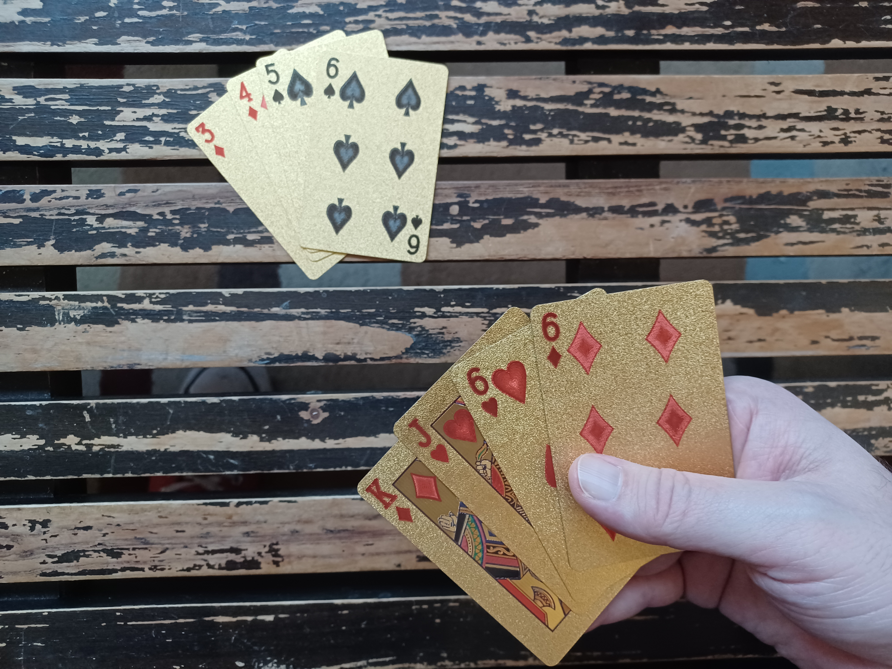
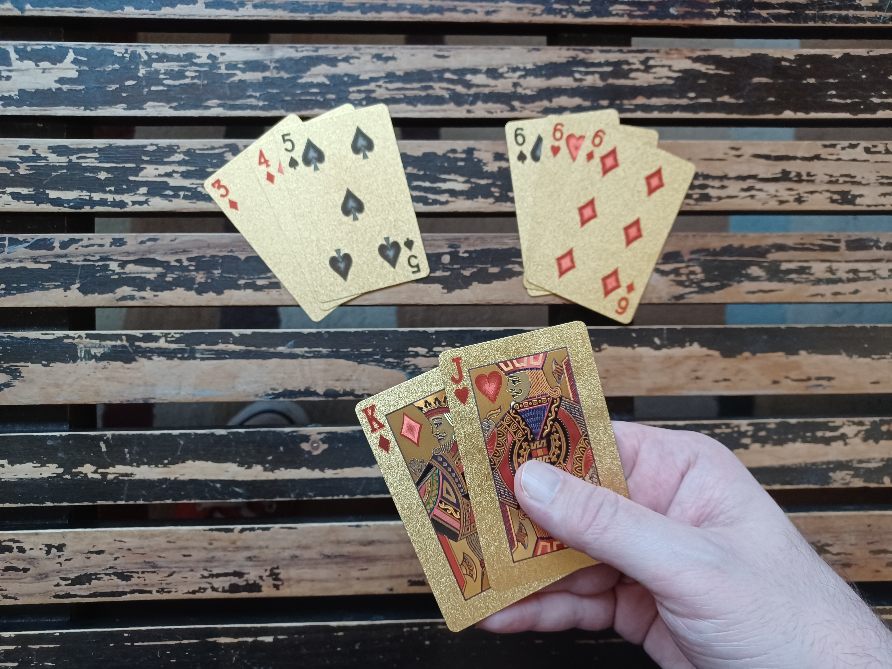

Dukes Up!
==================================================

> by Samuel Grey Keenan and Samuel Olaf Keenan

"Dukes Up!" is a 2-player card game played with a standard deck of cards.
It has a bit more depth than many 2-player options,
and it utilizes traditional rummy-style elements which will be familiar to card players.
You can play "Dukes Up!" as a single game, in about 15-20 minutes,
or you can play multiple games in a tournament style.

A video tutorial and visual aids are in the works.

> (the images right now are temporary placeholders)

 

<!-- INDEX -->
- Setup
- Objective
- Runs and Sets
- Taking Your Turn
  - Drawing
  - Playing Cards
  - Rearranging Cards
  - Taking the Opponent's DUKES
  - Replacing Your DUKES
  - Discarding
- Ending the Game
  - Playing Your FIEF
- Scoring

 

Setup
==================================================

1. Choose a player to go first.
If you are playing multiple games, switch back and forth.
2. Split the deck in half by color.
One player gets clubs/spades, and the other gets hearts/diamonds.
Remove the jokers.
3. Shuffle your half of the deck and draw 4 cards.
Set the remaining cards aside as your draw pile.
Players have their own draw and discard piles.
4. Choose 1 of the 4 cards as your FIEF, and place it face-down on the table.
Choose 2 cards as your DUKES, and place them face-down in front of your FIEF.
The left-over card will be part of your starting hand.

<!--

-->

5. Runs and sets will be played to the rest of the table.
6. Once both players have chosen their DUKES, they say, “Dukes Up!” in unison and flip up their DUKES.
The FIEFS remain face-down, and should be secret.

Objective
==================================================

Throughout the game, cards are played to the table in runs and sets.
At the end of the game, the player who has the most cards on the table wins.

The game ends when you take the opponent's FIEF.
However, the DUKES protect the FIEF, and they must be taken first.

Your goals are to play the most cards,
take the opponent's FIEF,
and protect your own FIEF.

Runs and Sets
==================================================

Runs and sets are a key rummy-style mechanic, though the details can vary between games.
This is how they work in "Dukes Up!":

- A set is a group ot 3 or more cards with matching values.
- A run is a group of 3 or more cards in sequential order and of the proper suit.
(Aces can be high or low, but not both.)
Runs can contain either spades and diamonds, or clubs and hearts.

One way to remember which suits go together in runs is to think of them as "thorns" and "flowers".
If the top of the suit symbol is pointed, it is a "thorn".
If the top of the suit symbol is rounded, it is a "flower".

Valid and invalid examples:

- `king of clubs, king of diamonds, king of hearts, king of spades` is a set of kings.
- `ten of spades, ten of clubs` is **not** a valid set, since it must be at least 3 cards.
- `nine of clubs, ten of clubs, jack of hearts, queen of clubs` is a run of clubs/hearts.
- `ace of diamonds, two of diamonds, three of diamonds` is a run of spades/diamonds.
- `two of spades, three of spades, four of clubs` is **not** a valid run, since spades/clubs cannot be combined.

Taking Your Turn
==================================================

You begin your turn by drawing.

Next, you may perform any of the following actions:

- Play cards from your hand.
- Rearrange runs/sets.
- Take the opponent's DUKES.
- Replace your own DUKES.

Finally, you must discard to end your turn.

Drawing
--------------------------------------------------

Start your turn by drawing up to 2 cards, ensuring that your hand does not exceed 4 cards.

You can draw from either your draw pile or your discard pile, but not both in the same turn.

If your draw pile is empty, shuffle your discard pile into a new draw pile.

Playing Cards
--------------------------------------------------

<!--
	image in this section?
	It would be redundant :/
-->

You can play cards from your hand to the table in runs/sets.
These may be new runs/sets, or they may add to existing ones.

Cards are played to a shared table, where both player's runs/sets are combined.

Sometimes, you can also play the opponent's DUKES to the table.
(See "Taking the Opponent's DUKES".)

Rearranging Cards
--------------------------------------------------

You can rearrange the runs/sets in play to change the layout of the table.
This is where much of the game's strategy comes from, as it allows you to get the opponent's cards stuck.

For a simple example, say a run of `three, four, five, six` is already on the table, and you have two sixes in your hand.
You may separate the six on the table from its run and combine it with the sixes from your hand to create a set of sixes.
The table would now have a run of 3 and a set of sixes, which is a valid arrangement.

When rearranging cards, there are 2 rules you must follow:

1. You cannot remove cards from play.
For instance, you cannot pick up a card that was played on a previous turn and put it in your hand.
2. Before discarding, all cards in play must be part of a valid run or set.
	<!-- example of not this? -->

Taking the Opponent's DUKES
--------------------------------------------------

You can take the opponent's DUKES by playing them in runs/sets, just like cards from your hand.
If possible, you are allowed to take both DUKES in a single turn.

Recall that DUKES protect the FIEF.
Once both of a player's DUKES are gone, they must flip up their FIEF *at the start of their next turn*.
They will have an opportunity to add new DUKES once their FIEF is face-up.
(See "Replacing Your DUKES".)

A *face-up* FIEF can be played to the table just like a DUKE,
except that any DUKE guarding it must be taken in the same turn.
Taking an opponent's FIEF ends the game.
(See "Ending the Game".)

<!--
IF have picture, pre- and post- duke taking
-->

Replacing Your DUKES
--------------------------------------------------

You can pick up your DUKES and exchange/replace them with cards from your hand.
However, you cannot replace DUKES that were taken by the opponent.

**The first player's first turn is a special case.**
On this turn, you can only exchange DUKES if you play the original DUKE in a run/set.
You cannot just pick up a DUKE and put it in your hand.

When you pick up a DUKE, you do not *have* to replace it.
If you leave the DUKE empty, it is just like the opponent took it.
The DUKE cannot be replaced on a later turn,
and if you leave both DUKES empty, you must flip up your FIEF *at the start of your next turn.*

Finally, each turn, if your FIEF is face-up and you have no DUKES, you can add a single DUKE back.
You cannot add both of your DUKES back,
and you cannot add new DUKES when your FIEF is face-down.

You are not allowed to exchange your FIEF.

Discarding
--------------------------------------------------

To end your turn, you must discard.
Cards are discarded face-down to your own discard pile.

There are four ways to discard:

1. Discard 1 card from your hand to the top of your discard pile.
2. Discard 2 cards from your hand to the top of your discard pile.
This can only be done if you perform no other actions during your turn.
You cannot play, exchange DUKES, or take the opponent's DUKES.
3. Discard 1 card from the top of your draw pile to the *bottom* of your discard pile.
You cannot look at it.
4. Discard 1 of *your own* cards from the play area to the top of your discard pile.
You can only do this if it leaves a valid arrangement of runs and sets behind.
Remember that runs/sets must be in a valid arrangement *before* you discard, as well.

Once you discard, your turn is over, and the other player may draw to start their turn.

You cannot look back through your discard pile.

Ending the Game
==================================================

In order to take an opponent's FIEF, it must be face-up, and any DUKE guarding it must be taken in the same turn.
Once taken, the game is over.
The attacking player gets a chance to play any additional cards from their hand before moving on to scoring.
<!-- fix -->

Additionally, if a player empties both their draw and discard piles, meaning all of their cards are either on the table or in their hand, the game is over.
The attacking player gets a chance to play any additional cards from their hand before moving on to scoring.

Playing Your FIEF
--------------------------------------------------

You can attempt to play your own FIEF in order to take the opponent's and end the game.
Because you are playing your own FIEF, you *must* take the opponent's in this turn.
You cannot end the game by eliminating your own FIEF.

To use your FIEF, play it in runs/sets just like any other card.
If you are unable to take the opponent's FIEF, you must return your FIEF to its position, *face-up*.

Scoring
==================================================

At the end of the game, the player with the most cards on the table wins.
This includes runs/sets, remaining DUKES, and remaining FIEFS.
Any cards of your color are considered yours.

 

<!-- potential images

	- flipping up fief
	- invalid state
	- swapping out dukes

-->
