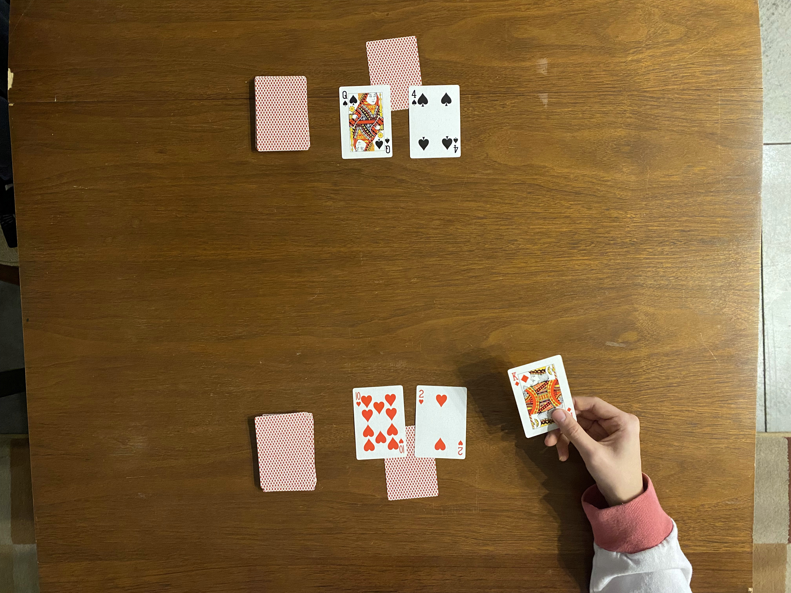

Dukes Up!
==================================================

> by Grey and Sam

"Dukes Up!" is a two-player game
played with a standard 52-card deck.
Inspired by "Rummy 100",
players arrange runs/sets on the table,
while trying to protect their CASTLES.
Once you learn how to play,
a single game takes about 15 minutes.

> A video tutorial is on the way.

 

<!-- INDEX -->
* Overview
* Setup
* Taking Your Turn
  * Runs, Sets, and Rearranging Cards
* Ending the Game
* Extra Balancing Rules
* More Examples

 

Overview
--------------------------------------------------

Each player has a card called the "CASTLE".
The goal is to take the opponent's CASTLE
by playing it in a run/set.
However, cards called "DUKES" protect the castle,
and must be taken first.

  

Setup
--------------------------------------------------

1. Split the deck in half by color.
  One player takes clubs/spades;
  the other gets hearts/diamonds.
1. Shuffle your half of the deck and draw 4 cards.
  Set the remaining cards aside as your draw pile.
1. Select 1 of the 4 cards as your CASTLE,
  and place it face-down on the table.
  Select 2 cards as your DUKES,
  and place them face-down in front of the CASTLE.
  The remaining card will be part of your starting hand.
1. Once both players have selected their DUKES,
  they say, "Dukes Up!" and flip up their DUKES in unison.
  The CASTLES remain face-down for now.

From here, the first player can start their turn.

Taking Your Turn
--------------------------------------------------

Start your turn by drawing.
Grab up to 2 cards,
but you can't have more than 4 cards total.
If your draw pile is empty,
reshuffle your discard pile.

Next, if you have no DUKES,
you must flip your CASTLE face-up.

Then, you can play.
Take any combination of the following actions:

* Create runs/sets using cards from your hand,
  the opponent's DUKES/CASTLE,
  or by rearranging cards on the table.
  > (See "Runs, Sets, and Rearranging Cards" below)
* Switch your remaining DUKES with cards from your hand.
* If you have *no* DUKES,
  create a single DUKE with a card from your hand.

Finally, you must discard to end your turn.
Choose one of the following options:

* Discard a card from your hand.
* Discard a card from your draw pile.
  Do not look at it.
* Discard 1 of your-color cards off of the table.
  The remaining cards must be in valid runs/sets.

If you don't play on your turn,
you may discard twice instead of once.

Discarding ends your turn.
The opponent is free to draw and start the next turn.

### Runs, Sets, and Rearranging Cards

A set is a group of 3+ cards,
all with the same value.

A run is a group of 3+ cards,
where cards have sequential values.
In "Dukes Up!",
cards in runs must have coordinating suits.
Spades/diamonds can go together,
and clubs/hearts can go together.

> An easy way to remember which suits go together
  is to look at the suit symbol.
  If the top is pointed, it's a "thorn";
  if it's rounded, it's a "flower".
  Thorns go with thorns, and flowers go with flowers.

set: 5&#9824;, 5&#9825;, 5&#9826; \
run of thorns: A&#9826;, 2&#9826;, 3&#9824; \
run of flowers: 10&#9827;, J&#9827;, Q&#9825;, K&#9825;, A&#9827;

If you can form a run/set with cards from your hand,
you can play it to the table.
Or, if you can form a run/set with the opponent's DUKE
(or face-up CASTLE),
you should take their DUKE and play it to the table.

Finally, keep in mind that you can rearrange existing runs/sets.
However, before you discard,
all cards previously played to the table
must be in valid runs/sets.

  
  

Ending the Game
--------------------------------------------------

Once you take the opponent's CASTLE,
the game ends.
Alternatively, if your draw and discard piles are both empty,
the game ends.

Players get 1 point for each card of their color on the table.
(This includes cards in runs/sets,
remaining DUKES, and remaining CASTLES.)
The player who eliminated their opponent's CASTLE
gets a 3 point bonus.
The higher score wins.

Extra Balancing Rules
--------------------------------------------------

Once you've played a couple times,
we *highly* recommend adding these rules
for balancing (and fun-ness) purposes.

* On the first player's first turn,
  they can't switch their DUKES.
* When you draw cards at the start of your turn,
  you can choose to draw from your discard pile instead.
* When you discard a card from your draw pile,
  place it on the bottom of your discard pile.
* On your final turn,
  you can play your CASTLE in a run/set.
  If you can't end the game in that turn,
  you must return your CASTLE to its position.

More Examples
--------------------------------------------------

TODO

<!--
* rearranging to play
  * doing it
  * valid/invalid arrangements
* swapping out DUKES
* creating DUKE
* playing your CASTLE
-->
