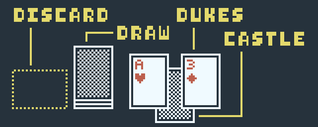
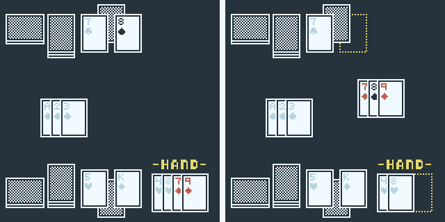
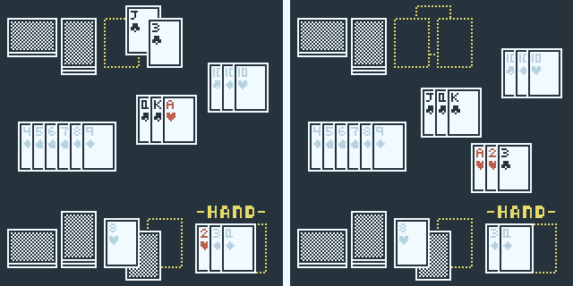

Dukes Up!
==================================================

> by Grey and Sam

"Dukes Up!" is a two-player card game
played with a standard deck.
Inspired by Manipulation Rummy,
players arrange runs/sets on the table
while trying to protect their CASTLES.
Once you learn how to play,
a single game takes about 15 minutes.

> A video tutorial is on the way.
  (maybe)

 

<!-- INDEX -->
* [Overview](#overview)
* [Setup](#setup)
* [Taking Your Turn](#taking-your-turn)
  * [Runs, Sets, and Rearranging Cards](#runs-sets-and-rearranging-cards)
* [Ending the Game](#ending-the-game)
* [Balancing Rules](#extra-rules)
* [More Examples](#more-examples)

 

Overview
==================================================

Each player has a single card called their "CASTLE".
Your goal is to take the opponent's CASTLE
by playing it in a run/set.
However, cards called "DUKES" protect the CASTLE,
and must be taken first.

Setup
==================================================

1. Remove jokers and split the deck by color.
  Give one player all the clubs/spades,
  and the other hearts/diamonds.
1. Shuffle your half of the deck
  and set it aside as your draw pile.
  Draw 4 cards.
1. Select 1 of the 4 cards as your CASTLE,
  and place it face-down on the table.
  Select 2 cards as your DUKES,
  and place them *face-down* in front of the CASTLE.
  The left-over card will be part of your starting hand.
1. Once both players pick their DUKES,
  they say, "Dukes Up!" and flip them face-up in unison.
  The CASTLES remain face-down for now.

From here, the first player can start their turn.

Taking Your Turn
==================================================

Start your turn by drawing.

* If your hand has 2 cards or fewer, you may draw 2 cards.
* If your hand has 3 cards, you can only draw 1 card.
* If your hand has 4 cards or more, skip drawing.

If your draw pile is empty, reshuffle your discard pile.

**Next, if you are out of DUKES,
you *must* flip your CASTLE face-up**.
Once up, it can be taken by the opponent.

Now, you can play.
Take any combination of the following actions:

* Create runs/sets using cards from your hand,
  by taking the opponent's DUKES/CASTLE,
  or by rearranging cards on the table.
  > (See ["Runs, Sets, and Rearranging Cards"](#runs-sets-and-rearranging-cards))
* Switch out your surviving DUKES with cards from your hand.
  [(example)](examples#defending)
  > You cannot switch out your CASTLE. \
  > You may pick up a DUKE without replacing it,
    but you cannot replace it on a later turn.
* If you have *no* DUKES, create one by placing a card from your hand.

You must discard to end your turn, but before discarding,
all cards on the table must be in legal runs/sets.

Cards are discarded face-down to your own discard pile.
Choose one of the following:

* Discard a card from your hand.
* Discard a card from your draw pile.
  Do not look at it, and do not look through your discard pile.
* Discard 1 of your-color cards off of the table.
  The remaining cards must be in legal runs/sets.
  [(example)](examples#discarding-off-the-table)

If you didn't play or change your DUKES, you may discard twice.

Discarding ends the turn.

Runs, Sets, and Rearranging Cards
--------------------------------------------------

In order to play cards, you must form runs and sets.
Runs and sets are played to a shared-table.

* A set is a group of 3+ cards with the same value.
* A run is a group of 3+ cards with sequential values and matching suits.
  In "Dukes Up!",
  **spades/diamonds** go together and **clubs/hearts** go together.

An easy way to remember which suits go together
is to look at the suit symbol.
If the top is pointed, it's a "thorn";
if it's rounded, it's a "flower".
Thorns go with thorns, and flowers go with flowers.

> `run of thorns:` A&#9824;, 2&#9824;, 3&#9824;, 4&#9824; \
  `run of thorns:` 8&#9826;, 9&#9826;, 10&#9824; \
  `run of flowers:` 10&#9827;, J&#9827;, Q&#9825;, K&#9825;, A&#9827; \
  `ILLEGAL run:` 5&#9827;, 6&#9824;, 7&#9824; \
  `ILLEGAL run:` 6&#9825;, 8&#9825;, 9&#9825;
>
> `set:` 5&#9824;, 5&#9825;, 5&#9826;

To play cards to the table, simply arrange them face-up in a run or set.
You may create new combinations or add to existing ones.
Use cards from your hand, *or use the opponent's DUKES*.
This is how you "take" the DUKES.

> Red creates a run of thorns to take Black's 8&#9824; DUKE.

Similarly, if you can use the opponent's face-up CASTLE in a run/set,
you can take it.
This ends the game.
**But**, to take a CASTLE,
you must take any DUKES guarding it in the same turn.

> Red takes Black's J&#9827; CASTLE to end the game.
  Notice that the 3&#9827; DUKE must be taken as well.

Finally, as the above example demonstrates,
you can rearrange existing runs/sets to form new ones.
[(example)](examples#rearranging-cards)
This is *key* to the game's strategy.
However, remember that before you discard,
*all cards on the table must be in legal runs/sets*.

Ending the Game
==================================================

Once you take the opponent's CASTLE,
the game ends.
Alternatively, if your draw and discard piles are both empty,
the game ends.

Players get 1 point for each card of their color on the table.
(This includes cards in runs/sets,
remaining DUKES, and remaining CASTLES.)
The player who eliminated their opponent's CASTLE
gets a 4 point bonus.
The higher score wins.

In a tie, the player who took their opponent's CASTLE wins.
(Or the player who ran out of cards wins.)

Balancing Rules
==================================================

Once you've played a couple times,
we *highly* recommend adding these rules
for balancing (and fun-ness) purposes.

* On the first player's first turn,
  they can't switch out their DUKES,
  unless they are playing their DUKES directly to the table.
* When you draw cards at the start of your turn,
  you can choose to draw from your discard pile instead.
  Then, when you discard a card from your draw pile,
  place it on the *bottom* of your discard pile.
* On your final turn,
  you can use your CASTLE in a run/set.
  If you can't end the game in that turn,
  you must return your CASTLE to its position, face-up.

More Examples
==================================================

If you're still confused,
hopefully this will help.

* Video examples and a tutorial
  can be found at [TODO].
* More examples can be found
  at [this page](examples).

 
 
 
 
 

[top](#dukes-up)
