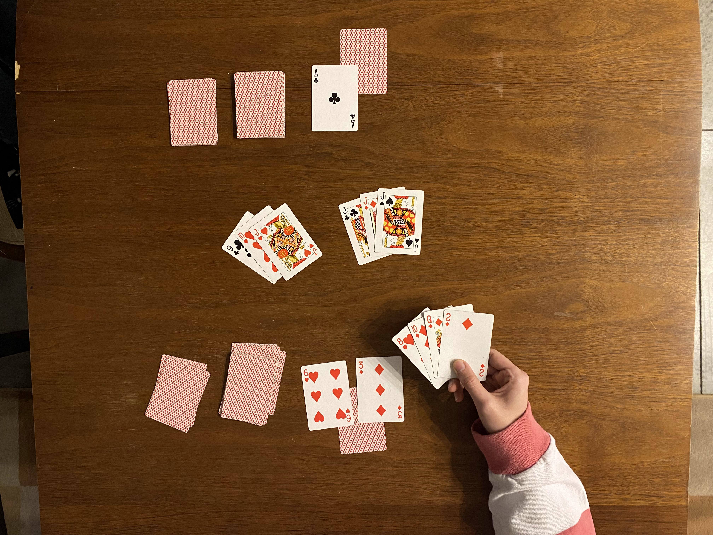
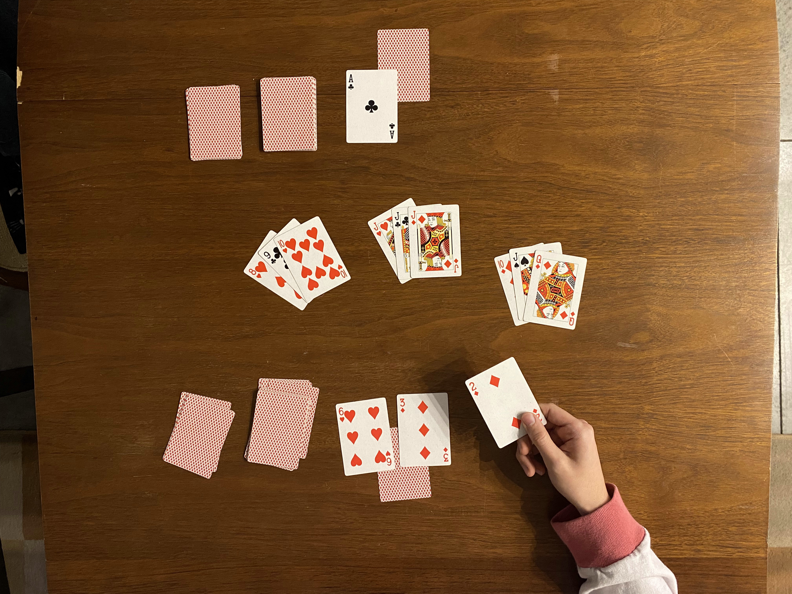
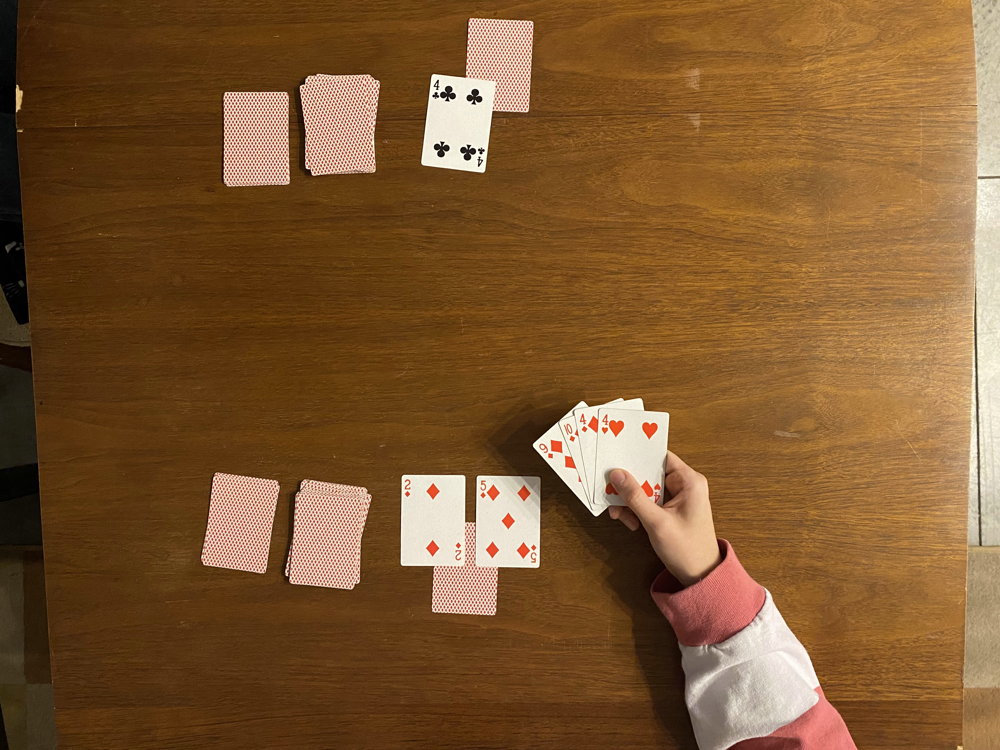
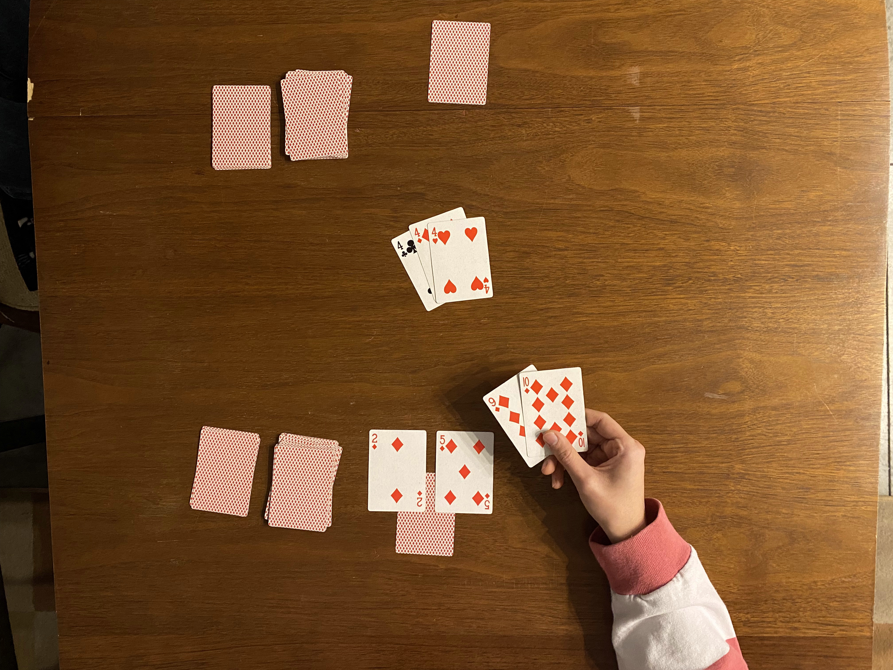

Dukes Up!
==================================================

> by Samuel Grey Keenan and Samuel Olaf Keenan

"Dukes Up!" is a 2-player card game played with a standard deck of cards.
It has rummy-style elements that might be familiar,
but with its own twist.
Once you get the hang of it,
a single game of "Dukes Up!" takes around 15 minutes.

> A video tutorial and other visual aids are in the works!

 

<!-- INDEX -->
- Setup
- Overview
- Runs and Sets
- Take Your Turn
  - Draw
  - Play Cards
  - Rearrange Cards
  - Take the Opponent's DUKES
  - Swap Out Your DUKES
  - Protect Your FIEF
  - Discard
- Ending the Game
  - Playing Your FIEF
- Scoring

 

Setup
==================================================

1. Choose a player to go first.
If you are playing multiple games, switch back and forth.
1. Split the deck in half by color.
One player gets clubs/spades, and the other gets hearts/diamonds.
Remove the jokers.
1. Shuffle your half of the deck and draw 4 cards.
Set the remaining cards aside as your draw pile.
Players have their own draw and discard piles.
1. Choose 1 of the 4 cards as your FIEF, and place it face-down on the table.
Choose 2 cards as your DUKES, and place them face-down in front of your FIEF.
The left-over card will be part of your starting hand.
	> Choosing strong cards is important,
	but if this is your first time playing,
	we recommend just picking something to get started.
	You'll get a feel for it once you're more familiar with the game.
1. Leave space on the table for the "play area".
1. Once both players have chosen their cards,
they say, “Dukes Up!” and flip up their DUKES in unison.
The FIEFS remain face-down.
1. With both players' DUKES revealed,
the first player can start their turn.

<!--
Once your FIEF is in place,
you can't check what it is!
-->

---

> (The table should look something like this after setting it up.)

---

Overview
==================================================

Throughout the game, you play cards in runs and sets.
Your goal is to take the opponent's FIEF by fitting it into runs/sets on the table.

FIEFS start the game face-down and protected.
Before you can take the opponent's FIEF,
you have to get through the DUKES that are guarding it.

Once a FIEF is taken, the game ends,
and the player who played the most cards wins.

Runs and Sets
==================================================

Runs and sets are ways to group cards together.
In "Dukes Up!" and many other rummy-style games,
creating runs/sets allows you to play cards to the table.
<!--
If you're completely unfamiliar with melds,
this game might be a bit confusing,
but we'll do our best to explain.
-->

- A set is a group of 3+ cards with the same value.
- A run is a group of 3+ cards in sequential order with coordinating suits.
Runs can be **spades/diamonds** or **clubs/hearts**. \
(Aces can be high or low, but not both.)

---

> (Runs and sets that have been played to the table.)

---

Here's a tip for remembering which suits go together.
Think of them as "thorns" and "flowers".
If the top of the suit is pointed, it's a "thorn".
If it's rounded, it's a "flower".

Valid and invalid examples:

- `king of clubs, king of diamonds, king of hearts, king of spades` is a set of kings.
- `ten of spades, ten of clubs` is **not** a valid set, since it must be at least 3 cards.
- `nine of clubs, ten of clubs, jack of hearts, queen of clubs` is a run of clubs/hearts.
- `ace of diamonds, two of diamonds, three of diamonds` is a run of spades/diamonds.
- `two of spades, three of spades, four of clubs` is **not** a valid run, since spades/clubs cannot be combined.

Take Your Turn
==================================================

There are a few things to do on your turn.

1. Start your turn by drawing.
1. Then, perform any of the following actions:
	* Play cards
	* Rearrange runs/sets
	* Take the opponent's DUKES
	* Swap out your DUKES
	* Protect your FIEF
1. End your turn by discarding.

Draw
--------------------------------------------------

Draw to start your turn.
Draw *up to* 2 cards,
as long as you won't have more than 4 cards.

Choose to draw from your draw pile or your discard pile,
but not both in the same turn.

If your draw pile is empty,
shuffle your discard pile into a new draw pile.

Play Cards
--------------------------------------------------

Play cards to the table in order to
gain points and take the opponent's cards.
You can play runs/sets from your hand,
or you can add to existing runs/sets.

---

> (Red plays cards from their hand, creating a new run and adding to an existing one.)

---

Once runs/sets have been played,
they are not "owned" by either player until scoring.
You may add on to the opponent's runs/sets,
and they may add on to yours.

In addition to cards from your hand,
you can sometimes play the opponent's DUKES or FIEF to the table. \
(See "Taking the Opponent's DUKES".)

Rearrange Cards
--------------------------------------------------

Rearrange runs/sets in order to change the layout of the table.
This is where much of the game's strategy comes from,
as it allows you to get the opponent's cards stuck.

For a simple example, say a run of `three, four, five, six` is already on the table, and you have two sixes in your hand.
You may separate the six on the table from its run and combine it with the sixes from your hand to create a set of sixes.
The table would now have a run (`three, four, five`) and a set of sixes.
This is considered a "valid arrangement" since all cards are part of a run or set.

---

> (Red rearranges cards in order to play.)

---

When rearranging cards, there are 2 rules you must follow:

1. You cannot remove cards from play.
For instance, you cannot pick up a card that was played on a previous turn and put it in your hand.
2. Before discarding, all cards in play must be part of a run or set.
<!-- example of not this? -->

<!--
---

> (A slightly more-complex example of rearranging cards.)

---
-->

Take the Opponent's DUKES
--------------------------------------------------

Take an opposing DUKE by fitting it into a valid run/set,
just like cards from your hand.

---

> (Red takes Black's `eight of spades` in a run using cards from their hand.)

---

Once both of a player's DUKES are gone,
their FIEF must be flipped up *at the start of their next turn*.
Now, it's vulnerable.
It can be taken and played in runs/sets like a DUKE,
with a catch. \
(See "Ending the Game".)

<!--
---

> ()

---
-->

Swap Out Your DUKES
--------------------------------------------------

Protect your own DUKES by swapping them out.
Pick up the original DUKE and put it in your hand;
then, use a card from your hand to replace it.
You cannot replace DUKES that were already empty.

---

> (The `five of diamonds` is a risky DUKE, so Red swaps it for the `three of diamonds`.)

---

When you pick up a DUKE, you do not *have* to replace it.
You may choose to leave it empty instead,
but it cannot be replaced on a later turn.
If you leave both DUKES empty,
you must flip up your FIEF *at the start of your next turn*,
just like if the opponent took them.

**The first player's first turn is a special case.**
On this turn, you can only swap out DUKES if you immediately play the original DUKE in a run/set.
You cannot just pick up a DUKE and put it in your hand.

*You cannot swap out your FIEF like a DUKE.

Protect Your FIEF
--------------------------------------------------

Protect a face-up FIEF by creating a DUKE.

Each turn, if your FIEF is face-up and you have no DUKES otherwise,
you may use a card from your hand to create a single DUKE.

You cannot get both of your DUKES back at any point,
and you cannot create DUKES when your FIEF is face-down.

---

> (Red has no DUKES, so they create a single new DUKE with a card from their hand.)

---

Discard
--------------------------------------------------

You must discard to end your turn.
Cards are discarded face-down to your own discard pile.

You have four options when discarding:

1. Discard 1 card from your hand to the top of your discard pile.
	> This is the most basic option.
2. Discard 2 cards from your hand to the top of your discard pile.
This can only be done if you perform no other actions during your turn.
You cannot play, replace DUKES, or take the opponent's DUKES.
	> Generally, if you aren't able to play anyways,
	this is a good choice.
3. Discard 1 card from the top of your draw pile to the *bottom* of your discard pile.
You cannot look at it.
	> We like to call this "burning".
	It allows you to hold on to important cards,
	but it comes at the cost of not knowing what you discarded.
4. Discard 1 of *your own* cards from the play area to the top of your discard pile.
You can only do this if it leaves a valid arrangement of runs and sets behind.
Remember that runs/sets must be in a valid arrangement *before* you discard, as well.
	> This is a valuable tool for defensive play,
	but you are losing a point each time you do it.

---

> (To prevent their `seven of diamonds` DUKE from being played in the run,
Red discards their `six of diamonds` at the end of their turn.
Notice that the remaining cards are all still in a valid run.)

---

Once you discard, your turn is over.
The other player may draw to start their turn.

*You cannot look back through your discard pile.

Ending the Game
==================================================

Take the opponent's FIEF to end the game.

Once the opponent's FIEF is face-up,
it can be taken and played in runs/sets.
However, you *must* take any DUKES guarding it in the same turn.
Taking the FIEF ends the game;
move on to scoring.

---

> (Red takes Black's FIEF to end the game!)

---

Alternatively, if your draw and discard piles are both empty,
meaining all of your cards are on the table or in your hand,
the game ends.
You may play any additional cards from your hand before moving on to scoring.

Playing Your FIEF
--------------------------------------------------

Sometimes, the easiest way to take the opponent's FIEF is to use your own.

You can attempt to play your own FIEF in order to take the opponent's and end the game.
Because you are playing your own FIEF, you *must* take the opponent's in this turn.
You cannot end the game by eliminating your own FIEF.

To use your FIEF, play it in runs/sets just like any other card.
It doesn't matter whether your FIEF started face-up or face-down.
If you are unable to take the opponent's FIEF,
you must return your FIEF to its position, *face-up*.

---

> (Red uses their own FIEF to take Black's and end the game!)

---

Scoring
==================================================

Count up the points to see who won!

* Add 1 point for each of your cards in runs/sets on the table.
All cards of your color are considered yours.
* Add 1 point for each of your remaining DUKES/FIEF.
* Add a 3-point bonus if you eliminated the opponent's FIEF.

The higher score wins,
and the attacker wins in a tie.

---

> Black has 8 points,
and red has 12.
(7 cards in runs/sets,
1 DUKE, 1 FIEF,
and +3 for taking out their opponent)

---

 

Have fun!

 

<!--
It's tempting to be competitive
and try to keep your though processes secret,
but in our esperience,
it's more fun to talk through your plans, or lie, out loud.
-->

<!--
Additional rules
==================================================

* jokers
	* under draw
	* randomly
	* finishing pils reward
	* as FIEF
* scoring variants
	* 2-5 bonus
* swapping FIEF
* guessing FIEF
-->

<!--
rule variants

* use the term "melds"
* pure-rules, no help/flavor
-->
